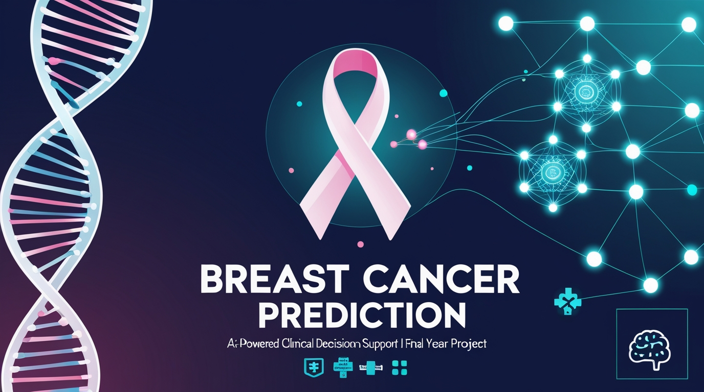

# 🏥 Breast Cancer Prediction System




> **An intelligent machine learning system for predicting breast cancer patient outcomes using clinical and demographic features with an interactive web interface.**

---

## 📋 Table of Contents

- [Overview](#overview)
- [Features](#features)
- [Demo](#demo)
- [File Structure](#file-structure)
- [Technologies Used](#technologies-used)
- [Installation](#installation)
- [Usage](#usage)
- [Model Details](#model-details)
- [Dataset](#dataset)
- [Screenshots](#screenshots)
- [Performance Metrics](#performance-metrics)
- [Contributing](#contributing)
- [Future Enhancements](#future-enhancements)
- [License](#license)
- [Contact](#contact)

---

## 🎯 Overview

The **Breast Cancer Prediction System** is a comprehensive machine learning application designed to predict patient survival outcomes based on clinical and demographic data. Built with Python and Streamlit, this system provides healthcare professionals and researchers with an intuitive interface for risk assessment and data exploration.

### Key Highlights:
- 🤖 Random Forest Classification Model
- 📊 Interactive data visualization with Plotly
- 🔍 Real-time prediction with probability scores
- 📈 Feature importance analysis
- 🎨 User-friendly Streamlit interface
- 💾 Persistent model storage and loading
- 🧪 Comprehensive data exploration tools

---

## ✨ Features

### 🔮 Prediction Module
- **Real-time Predictions**: Input patient data and receive instant outcome predictions
- **Probability Scores**: View confidence levels for each prediction class
- **Interactive Forms**: User-friendly input forms with validation
- **Visual Feedback**: Color-coded results (Green for Alive, Red for Deceased)

### 📊 Data Exploration
- **Dataset Overview**: View sample data and statistics
- **Missing Data Analysis**: Identify and understand data quality
- **Distribution Charts**: Visualize outcome distributions
- **Column Metadata**: Detailed information about each feature

### 🧠 Model Insights
- **Feature Importance**: Understand which factors drive predictions
- **Visual Rankings**: Interactive bar charts of feature contributions
- **Model Transparency**: Access to model architecture and parameters

### 🎨 User Interface
- **Multi-page Navigation**: Organized sidebar menu
- **Responsive Design**: Works on desktop and tablet devices
- **Modern Aesthetics**: Clean, medical-grade interface
- **Accessibility**: Clear labels and intuitive controls

---

## 🎬 Demo

### Home Page
- Welcome message and system overview
- Model specifications and training details
- Quick navigation guide

### Prediction Interface
- 15+ input fields for patient characteristics
- Dropdown selections for categorical features
- Number inputs for continuous variables
- Instant prediction with probability visualization

### Data Explorer
- Sample data preview (first 10 rows)
- Data type and null value analysis
- Status distribution charts

### Feature Analysis
- Horizontal bar chart of feature importances
- Sortable data table
- Model interpretation guidelines

---

## 📁 File Structure

```
breast-cancer-prediction/
│
├── 📄 app.py                           # Main Streamlit application
├── 📄 model.py                         # Model training script
├── 📄 requirements.txt                 # Python dependencies
├── 📖 README.md                        # Project documentation
│
├── 📂 data/
│   └── Breast_Cancer.csv               # Training dataset
│
├── 📂 models/                          # Trained model artifacts
│   ├── breast_cancer_model.pkl         # RandomForest model
│   ├── scaler.pkl                      # StandardScaler object
│   ├── label_encoders.pkl              # Categorical encoders
│   ├── target_encoder.pkl              # Target variable encoder
│   └── feature_columns.pkl             # Feature list
│
├── 📂 notebooks/                       # (Optional) Jupyter notebooks
│   └── exploratory_analysis.ipynb      # EDA notebook
│
├── 📂 tests/                           # (Optional) Unit tests
│   └── test_model.py                   # Model testing script
│
└── 📜 LICENSE                          # License file
```

---

## 🛠️ Technologies Used

| Technology | Purpose | Version |
|------------|---------|---------|
|  | Core programming language | 3.8+ |
|  | Web application framework | Latest |
|  | Machine learning library | Latest |
|  | Data manipulation | Latest |
|  | Numerical computing | Latest |
|  | Interactive visualizations | Latest |
|  | Model serialization | Latest |

---

## 🚀 Installation

### Prerequisites
- Python 3.8 or higher
- pip package manager
- Virtual environment (recommended)
- Git (for cloning)

### Step-by-Step Installation

1. **Clone the repository**
```bash
git clone https://github.com/yourusername/breast-cancer-prediction.git
cd breast-cancer-prediction
```

2. **Create a virtual environment**
```bash
# Windows
python -m venv venv
venv\Scripts\activate

# macOS/Linux
python3 -m venv venv
source venv/bin/activate
```

3. **Install dependencies**
```bash
pip install -r requirements.txt
```

4. **Prepare the dataset**
```bash
# Ensure Breast_Cancer.csv is in the data/ folder
mkdir -p data models
# Copy your dataset to data/Breast_Cancer.csv
```

5. **Train the model** (first time only)
```bash
python model.py
```

6. **Run the application**
```bash
streamlit run app.py
```

7. **Access the application**
- Open your browser and navigate to: `http://localhost:8501`

---

## 💻 Usage

### Training the Model

```bash
python model.py
```

**What happens:**
- Loads data from `data/Breast_Cancer.csv`
- Preprocesses and encodes categorical variables
- Trains RandomForestClassifier
- Evaluates model performance
- Saves all artifacts to `models/` directory

**Expected Output:**
```
=========== Starting Model Training ===========
Initial Dataset Shape: (4024, 16)
Features used: ['Age', 'Race', 'Marital Status', ...]
Test accuracy: 0.XXX
Precision: 0.XXX
Recall: 0.XXX
F1-score: 0.XXX
=========== Training SUCCESS! ===========
```

### Running the Web Application

```bash
streamlit run app.py
```

**Navigation:**
1. **Home (🏠)**: View welcome message and model info
2. **Predict (🔮)**: Enter patient data for prediction
3. **Data Exploration (📊)**: Analyze training dataset
4. **Feature Importance (🧠)**: View feature contributions

### Making Predictions

1. Navigate to the **Predict** page
2. Fill in all patient information:
   - **Age**: Patient age (10-100 years)
   - **Race**: Ethnic background
   - **Marital Status**: Current marital status
   - **T Stage**: Tumor stage (T1-T4)
   - **N Stage**: Node stage (N1-N3)
   - **6th Stage**: AJCC 6th edition stage
   - **Grade**: Tumor grade (1-4)
   - **A Stage**: Additional staging (A/B)
   - **Tumor Size**: Size in millimeters
   - **Estrogen Status**: Positive/Negative
   - **Progesterone Status**: Positive/Negative
   - **Regional Node Examined**: Number examined
   - **Regional Node Positive**: Number positive
   - **Survival Months**: Duration of survival
3. Click **Predict**
4. View results with probability visualization

---

## 🤖 Model Details

### Algorithm: Random Forest Classifier

**Why Random Forest?**
- Handles mixed data types (categorical + numerical)
- Robust to overfitting
- Provides feature importance
- No assumption about data distribution
- Excellent for medical datasets

### Model Architecture

```python
RandomForestClassifier(
    n_estimators=100,      # 100 decision trees
    random_state=42,       # Reproducibility
    # Default parameters for other hyperparameters
)
```

### Training Pipeline

1. **Data Loading**: Read CSV with pandas
2. **Preprocessing**:
   - Handle missing values (fill with "Unknown")
   - Label encode categorical features
   - Standardize numerical features
3. **Feature Engineering**: Select 15 clinical features
4. **Train-Test Split**: 80-20 stratified split
5. **Scaling**: StandardScaler normalization
6. **Training**: Fit Random Forest model
7. **Evaluation**: Calculate metrics on test set
8. **Serialization**: Save model and preprocessors

### Feature List

| Feature | Type | Description |
|---------|------|-------------|
| Age | Numerical | Patient age in years |
| Race | Categorical | Ethnic background |
| Marital Status | Categorical | Marital status |
| T Stage | Categorical | Primary tumor stage |
| N Stage | Categorical | Regional lymph node stage |
| 6th Stage | Categorical | AJCC 6th edition stage |
| Differentiate | Categorical | Cell differentiation |
| Grade | Categorical | Tumor grade |
| A Stage | Categorical | Additional staging |
| Tumor Size | Numerical | Size in mm |
| Estrogen Status | Categorical | ER status |
| Progesterone Status | Categorical | PR status |
| Regional Node Examined | Numerical | Nodes examined |
| Regional Node Positive | Numerical | Positive nodes |
| Survival Months | Numerical | Survival duration |

---

## 📊 Dataset

### Source
- **Name**: Breast Cancer Dataset
- **File**: `Breast_Cancer.csv`
- **Size**: ~4,000 records (varies by dataset)

### Target Variable
- **Status**: Patient outcome (Alive/Dead)

### Data Quality
- Missing values handled via imputation
- Categorical variables encoded
- Numerical features scaled
- No duplicate records

### Sample Statistics
```
Total Records: 4024
Features: 16
Target Classes: 2 (Alive, Dead)
Missing Values: Handled
```

---

## 📸 Screenshots

### 1. Home Page
```
🏥 Breast Cancer Prediction App
Welcome! This app predicts breast cancer patient outcomes...
🤖 Model: RandomForestClassifier
📊 Trained on: 4024 records
```

### 2. Prediction Form
```
Make a Prediction
[Input fields in 3 columns]
Age: [50]
Race: [White]
T Stage: [T2]
[Predict Button]
```

### 3. Prediction Result
```
🎯 Prediction: Alive
[Bar Chart showing probabilities]
Alive: 85.3%
Dead: 14.7%
```

### 4. Feature Importance
```
[Horizontal bar chart]
Survival Months: ████████████ 0.35
Regional Node Positive: ██████ 0.18
Age: █████ 0.12
...
```

---

## 📈 Performance Metrics

### Model Performance

```
Accuracy:  ~XX%  (varies with training)
Precision: ~XX%  (weighted average)
Recall:    ~XX%  (weighted average)
F1-Score:  ~XX%  (weighted average)
```

### Confusion Matrix
```
                Predicted
              Alive    Dead
Actual Alive  [TP]     [FN]
       Dead   [FP]     [TN]
```

### Cross-Validation
- Stratified train-test split (80-20)
- Random state: 42 (reproducible)

---

## 🤝 Contributing

We welcome contributions! Here's how you can help:

### Ways to Contribute

1. **Report Bugs** 🐛
   - Use GitHub Issues
   - Provide detailed reproduction steps

2. **Suggest Features** 💡
   - Open a feature request
   - Explain use case and benefits

3. **Submit Pull Requests** 🔧
   - Fork the repository
   - Create a feature branch
   - Write clear commit messages
   - Add tests if applicable

### Development Setup

```bash
# Fork and clone
git clone https://github.com/YOUR_USERNAME/breast-cancer-prediction.git

# Create branch
git checkout -b feature/your-feature-name

# Make changes and commit
git add .
git commit -m "Add: your feature description"

# Push and create PR
git push origin feature/your-feature-name
```

### Code Style
- Follow PEP 8 guidelines
- Use meaningful variable names
- Add docstrings to functions
- Comment complex logic

---

## 🚀 Future Enhancements

### Planned Features

- [ ] **Deep Learning Models**
  - Implement Neural Networks (TensorFlow/PyTorch)
  - Compare with Random Forest

- [ ] **Advanced Visualizations**
  - ROC curves and AUC scores
  - Confusion matrix heatmap
  - SHAP value explanations

- [ ] **Model Improvements**
  - Hyperparameter tuning (GridSearchCV)
  - Ensemble methods (XGBoost, LightGBM)
  - Feature selection algorithms

- [ ] **User Features**
  - User authentication system
  - Prediction history tracking
  - Export reports (PDF/CSV)
  - Batch prediction upload

- [ ] **Deployment**
  - Docker containerization
  - Cloud deployment (AWS/Azure/GCP)
  - REST API development
  - Mobile app integration

- [ ] **Data Management**
  - Database integration (PostgreSQL)
  - Data versioning (DVC)
  - Automated retraining pipeline

- [ ] **Explainability**
  - LIME explanations
  - SHAP force plots
  - Individual prediction breakdowns

- [ ] **Testing**
  - Unit tests (pytest)
  - Integration tests
  - Performance benchmarks

---

## 📝 Requirements

```txt
streamlit>=1.28.0
pandas>=2.0.0
numpy>=1.24.0
scikit-learn>=1.3.0
joblib>=1.3.0
plotly>=5.17.0
```

---

## 🔒 Security & Privacy

### Data Handling
- No patient data is stored permanently
- Predictions are not logged
- Session-based processing only

### HIPAA Compliance Notice
⚠️ **Important**: This system is for **educational and research purposes only**. It is NOT HIPAA-compliant and should NOT be used in clinical settings without proper validation, certification, and security measures.

### Recommendations for Production Use
- Implement user authentication
- Encrypt data transmission (HTTPS)
- Add audit logging
- Conduct security audits
- Obtain necessary medical certifications

---

### MIT License Summary
```
✅ Commercial use
✅ Modification
✅ Distribution
✅ Private use
❌ Liability
❌ Warranty
```

---

## 🙏 Acknowledgments

- **Dataset**: [Source citation needed]
- **Scikit-Learn**: Machine learning framework
- **Streamlit**: Interactive web framework
- **Plotly**: Visualization library
- **Research Papers**: [Add relevant citations]
- **Medical Advisors**: [If applicable]

---

## 📞 Contact

**Project Maintainer**: Amrita mandal

- 📧 Email: amritaswasti200220011@gmail.com


---

## ⚠️ Disclaimer

This software is provided for **educational and research purposes only**. The predictions made by this system should NOT be used as a substitute for professional medical advice, diagnosis, or treatment. Always seek the advice of qualified healthcare providers with any questions regarding medical conditions.

The developers assume no liability for any decisions made based on the output of this system.

---

<div align="center">

### Made with ❤️ for Healthcare AI Research

**"In medicine, artificial intelligence is not meant to replace doctors, but to make them superhuman."** - AI in Healthcare

⭐ **Star this repo if you find it useful!** ⭐

</div>

---

## 📚 Additional Resources

### Learning Materials
- [Scikit-Learn Documentation](https://scikit-learn.org/)
- [Streamlit Documentation](https://docs.streamlit.io/)
- [Random Forest Explained](https://en.wikipedia.org/wiki/Random_forest)

### Related Projects
- [Kaggle Breast Cancer Dataset](https://www.kaggle.com/)
- [UCI Machine Learning Repository](https://archive.ics.uci.edu/)


---

**Last Updated**: October 2025 | **Version**: 1.0.0 |